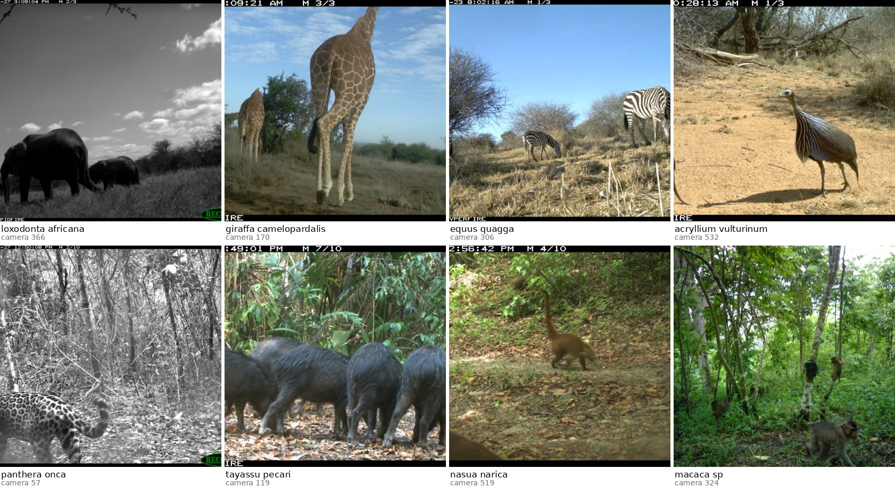

# 🐆 Species classification on camera trap imagery



---

## 📷 Introduction

Camera traps are now a common way to monitor biodiversity in remote places. A motion
sensor triggers the camera, which captures a burst of images. Someone then has to go
through those images and identify the species that set the camera off, and those
identifications become the ecological statistics: which species live in a study area,
and how many.

In this project you will build deep learning models that automate the identification
step. You will use the [iWildCam 2020](https://arxiv.org/abs/2004.10340) dataset: over 200,000 images from more than 300 
camera traps, at sites in Central America, East Africa, South America and Southeast Asia, 
labelled with a fine-grained taxonomy of 60 species.

---

## 🎯 The challenge: camera generalisation

The challenge here is generalising to a new camera. Your models are evaluated
out-of-distribution: **every image in the test set comes from a camera that never appears
in training.** The ResNet baseline loses about a third of its performance in this setting
compared with one where it sees every camera at both training and test time.

That setting is the real use case — a field team installs a camera at a new spot and the
model has to work there on day one. To help, you are allowed to use the empty images (the
frames with no animal in them) from the test cameras. They carry no species label, so
using them is unsupervised adaptation, not cheating.


Suggested directions to explore:

- 🧠 Model architecture / foundation models
- 🎨 Data preprocessing / augmentation
- 🔄 Domain adaptation
- ⚡ Test-time adaptation

---

## 🚀 Getting started

### 📦 Data

1. Get the dataset from [Kaggle](https://www.kaggle.com/c/iwildcam-2020-fgvc7). You will need an account and you will have to accept the competition rules (that does not mean you take part in it).
You can laucnh the download directly in CLI from the cluster machine using the kaggle package (you will be prompted to log in and generate an api token, simply follow the instructions).
```bash
uv tool install kaggle # install package
kaggle competitions download -c iwildcam-2020-fgvc7 -p PATH/TO/DATA/iWildCam2020
# Adapt the data path
```
2. Unzip it.
```bash
 unzip PATH/TO/DATA/iWildCam2020/iwildcam-2020-fgvc7.zip -d PATH/TO/DATA/
 iWildCam2020
 # Adapt the data path
```
3. Prepare it: `prepare.py` writes a copy of every image 448 pixels high, which is what
   makes training fast enough to iterate on. You can revisit this choice later.

```bash
uv run python prepare.py --source PATH/TO/DATA/iWildCam2020 --height 448
```

### 🔍 Data exploration

`notebooks/01_data_explo.ipynb` is a tour of the dataset and the task. 
`data/README.md` describes every shipped file and every metadata column.

### 🏋️ Training code

Once the data is prepared:

```bash
uv run python -m iwildcam.train --config configs/reference.yaml
```

---

## 📋 The task in one page

**Input**: one camera-trap JPEG.

**Output**: one of **60 species** — every species with at least 10 images at at least 5
distinct cameras. That leaves **127,681 labelled images** from 294 cameras, out of the
201,399 rows in the metadata.

**Splits** — pick one with `split:` in the config:

| split | what it is | use it for |
| --- | --- | --- |
| `official_ood` | test = the 48 OOD test cameras | **the protocol.** Report this |
| `random_burst` | in-distribution, whole bursts move together | the reference the gap is measured against |

`official_ood` divides those images **85,265 train / 14,652 val / 27,764 test**, with no
camera spanning train and test. You will count **46** test cameras, not 48: cameras 370
and 489 have images, but every species at them falls outside the 60-class set, so nothing
of theirs survives into the labelled task.

**Metric**: `test_macro_f1_present` — macro F1 over the species the test cameras actually
contain. Accuracy is reported alongside and is not the headline.

**Also shipped**: **69,469 unlabelled empty frames**, 34% of the annotated images, reachable
per camera through `unlabelled_frames(task, cameras=...)`. Using the ones from the *test*
cameras is the point, not cheating — they carry no species label. Only **35 of the 48** test
cameras have any, so 13 give you nothing. And a **taxonomy**, `data/taxonomy.csv`:
60 species → 54 genera → 30 families → 11 orders.

---

## 🗂️ Repository map

```
iwildcam/            the code you will modify
  data.py            task loading, the class filter, the two folds, image reading
  models.py          ResNetClassifier, features(), logits()
  train.py           training loop, evaluation, CLI
  train_utils.py     run keys, per-run log file, W&B, resume, config reading
configs/             fast.yaml (resnet18 @224, iterate) and reference.yaml (resnet50 @448, report)
tests/               the protocol as assertions — keep it green
notebooks/           a guided tour of the data and the splits
data/                metadata.csv.gz, taxonomy.csv, gps_locations.json, the 48 test cameras;
                     the image folders land here after prepare.py (gitignored).
                     data/README.md describes every file and every metadata column
assets/              the figures on this page, and the script that rebuilds them
results/             runs.jsonl (one line per completed run) and preds/ (raw predictions)
prepare.py           resizes the downloaded archive into a folder of JPEGs; resumable
```

---

## 🙏 Credits

The photographs were collected by field biologists working with the **Wildlife Conservation Society**, 
released through the iWildCam competition series, and annotated by the people credited below. 
Some camera locations are deliberately withheld or generalised as an anti-poaching measure.

**The dataset.** Sara Beery, Elijah Cole and Arvi Gjoka, *The iWildCam 2020 Competition
Dataset*, 2020. [arXiv:2004.10340](https://arxiv.org/abs/2004.10340)

```bibtex
@article{beery2020iwildcam,
  title   = {The iWildCam 2020 Competition Dataset},
  author  = {Beery, Sara and Cole, Elijah and Gjoka, Arvi},
  journal = {arXiv preprint arXiv:2004.10340},
  year    = {2020}
}
```

**The OOD split.** The 48 held-out test cameras and the out-of-distribution protocol come from
WILDS: Pang Wei Koh, Shiori Sagawa, Henrik Marklund and 20 others, *WILDS: A Benchmark of
in-the-Wild Distribution Shifts*, 2020.
[arXiv:2012.07421](https://arxiv.org/abs/2012.07421)

```bibtex
@article{koh2021wilds,
  title   = {{WILDS}: A Benchmark of in-the-Wild Distribution Shifts},
  author  = {Koh, Pang Wei and Sagawa, Shiori and Marklund, Henrik and others},
  journal = {arXiv preprint arXiv:2012.07421},
  year    = {2020}
}
```

**The labels.** The species labels and sequence ids shipped here come from the 2022 iWildLife
re-annotation of the same photographs, which corrected mistakes in the 2020 release. 

Cite both papers in anything you publish or hand in from this project.
